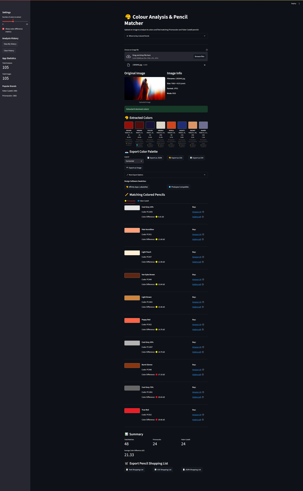

# 🎨 Image Analyses & Colour Matcher

A Streamlit app that analyzes uploaded images to extract dominant colors and match them to real-world colored pencils like Prismacolor and Faber-Castell.

---

## 🚀 Features

- 📸 Upload PNG or JPG images
- 🧠 Automatic color palette extraction
- 🖍️ Real-world pencil matching from major brands
- 🎨 Export palettes to:
  - JSON, CSV, CSS, SCSS
  - Adobe Swatch formats
  - Figma, Affinity, Photopea
- 🖼️ Visual swatch generation
- 🗃️ Local SQLite database to track sessions and history

---

## 🖥 Demo



---

## ⚙️ Installation

1. Clone this repo:
   ```bash
   git clone https://github.com/Cproton69/image-analyser-app.git
   cd image-analyser-app
